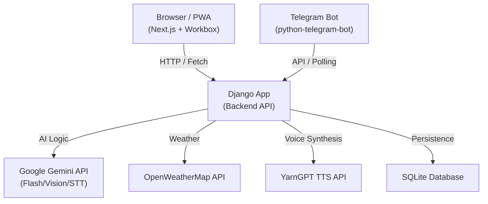
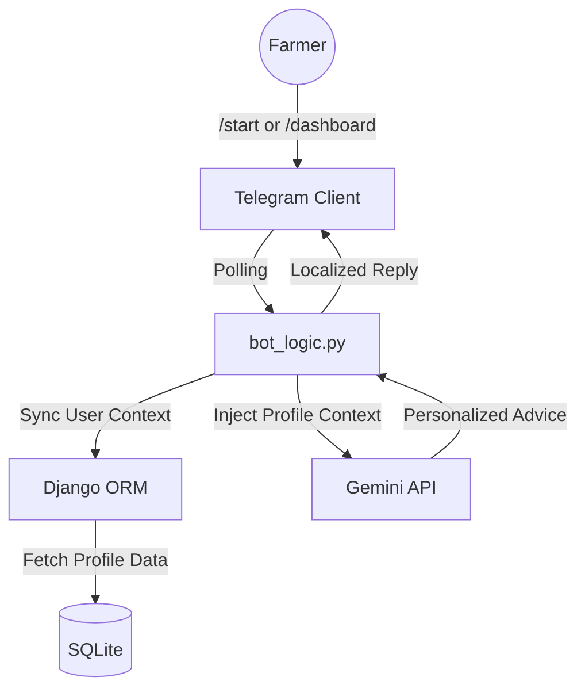

# FarmBuddy 🌾
**AI-powered agricultural advisor for Nigerian smallholder farmers**

FarmBuddy is a comprehensive agricultural assistant that provides Nigerian farmers with instant advice via text and voice, plant disease diagnosis from photos, and local weather-aware recommendations. It is available as a **Progressive Web App (PWA)** for offline access and a **Telegram Bot** for cross-platform utility.

---

## Project Structure

This project is a monorepo consisting of:
- **`app/`**: A modern Next.js frontend built with React, Tailwind CSS, and Shadcn UI.
- **`backend/`**: A robust Django 5 backend that integrates with Gemini AI for logic/vision and YarnGPT for Nigerian voice synthesis.

---

## Features

| Category | Feature | Description |
|---|---|---|
| 🤖 **AI Advice** | **Personalized Chat** | Get agricultural advice tailored to your farm's size, soil, and pest history. |
| 🌍 **Localization** | **4 Languages** | Full support for English, Hausa (ha), Igbo (ig), and Yoruba (yo). |
| 📸 **Vision** | **Plant Diagnosis** | Upload a leaf photo; Gemini Vision identifies diseases and suggests treatments. |
| 🔊 **Audio** | **Voice I/O** | Speak questions (Gemini STT) and listen to replies (YarnGPT TTS with Nigerian accents). |
| 🌦️ **Weather** | **Contextual Forecasts** | Real-time weather data is automatically fed into AI advice and dashboard charts. |
| 👤 **Accounts** | **Cross-Platform Auth** | Link your Telegram to your web account or sign up directly via the bot. |
| 🔐 **Account Recovery**| **Security Answer** | Recover forgotten passwords securely using a security question. |
| 📁 **Chat Management** | **Chat History** | Rename, delete, and manage multiple conversation threads with persistence. |
| 📱 **Telegram Bot** | **Native Experience** | Full access to chat, dashboard, and /forecast without needing the web app. |
| 📶 **PWA** | **Offline Support** | Installed app works on the home screen; saves chat history for offline reading. |

---

## Architecture

### System Overview


### Telegram Bot Architecture


---

## Progressive Web App (PWA)

FarmBuddy is designed to work in areas with low or no connectivity:
- **Offline Mode**: Access previous chat sessions and diagnostics without an internet connection.
- **Service Worker**: Core assets are cached locally using Workbox for near-instant load times.
- **Installable**: Add FarmBuddy to your mobile home screen for a full-screen, native-app experience.
- **Offline Fallback**: A custom offline page is displayed when connectivity is lost.

---

## Telegram Bot Integration

The FarmBuddy bot (@myfarmbuddy_bot) allows full management of your farm:
- **Commands**: 
    - `/start`: Select language and Login/Sign up.
    - `/dashboard`: See your farm stats (Size, Soil, Pests).
    - `/forecast`: Get a 7-day weather chart as an image.
    - `/edit_profile`: Update your farm data directly from Telegram.
    - `/language`: Switch between English, Hausa, Igbo, and Yoruba.
- **AI Chat**: Send text or voice notes directly to the bot for agricultural support.
- **Plant Diagnosis**: Send a leaf photo to the bot for instant identification.

---

## Tech Stack

| Layer | Technology |
|---|---|
| **Frontend** | Next.js 15+ / React / Tailwind CSS / Shadcn UI |
| **Backend** | Python 3.10+ / Django 5+ |
| **PWA** | Service Workers / Manifest.json / Workbox |
| **AI — Logic** | Google Gemini (`gemini-1.5-flash`) |
| **AI — Audio** | YarnGPT TTS (Nigerian Voices: Idera, Zainab, Chinenye) |
| **Weather** | OpenWeatherMap REST API |

---

## Getting Started

### 1. Backend Setup
```bash
cd backend
python -m venv venv
source venv/bin/activate  # Windows: venv\Scripts\activate
pip install -r requirements.txt
python manage.py migrate
python manage.py runserver
```

### 2. Frontend Setup
```bash
cd app
npm install
npm run dev
```

### 3. Telegram Bot Setup
In a separate terminal with the backend virtual environment active:
```bash
cd backend
python manage.py run_bot
```

### 4. Environment Variables
Create a root `.env` or individual `.env` files with:
```env
SECRET_KEY=your_django_secret
GOOGLE_API_KEY=your_gemini_key
OPENWEATHER_API_KEY=your_weather_key
YARNGPT_API_KEY=your_yarngpt_key
TELEGRAM_BOT_TOKEN=your_bot_token
```

---

## Recent Improvements 🚀

- **Robust Internationalization**: Enforced English as the global default with hydration-safe context management.
- **Enhanced Signup Flow**: Improved multi-step signup with structured error handling, name synchronization, and optional farm detail sanitization.
- **Voice Performance**: Optimized TTS (Text-to-Speech) latency and improved STT (Speech-to-Text) accuracy for Nigerian accents.
- **UI/UX Polishing**: Fixed hydration errors, improved chat layout responsiveness, and standardized translation dictionaries across 4 languages.

---

## Deployment

### Backend (Django)
The backend is designed for deployment on platforms like Render, Railway, or VPS. Ensure you set the environment variables listed above.

### Frontend (Next.js)
Deploy the frontend to Vercel or Netlify for the best Next.js compatibility.

---

## Author
- **Author**: [Abdul-Salam15](https://github.com/Abdul-Salam15)
- **License**: MIT
