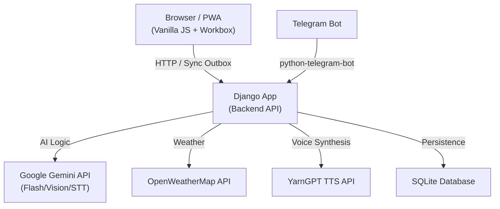
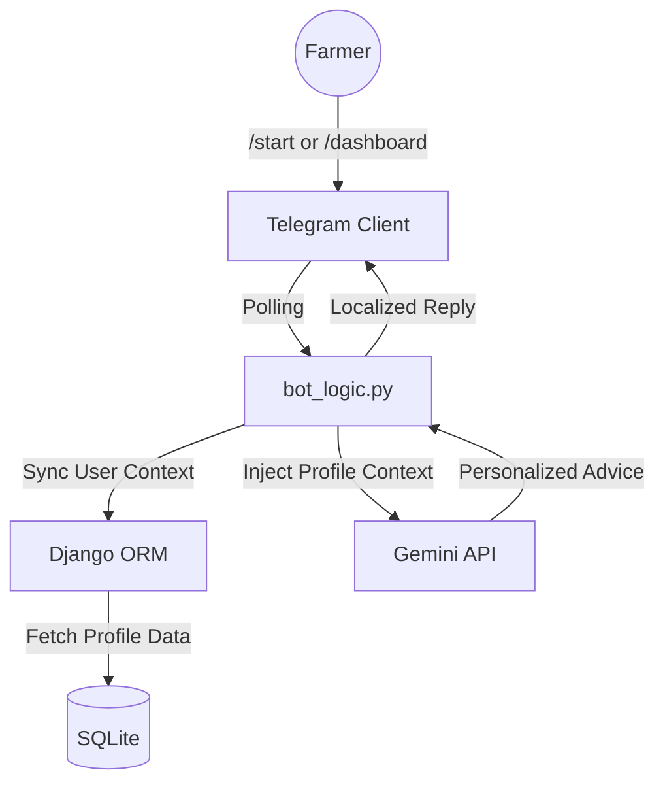

# FarmBuddy 🌾
**AI-powered agricultural advisor for Nigerian smallholder farmers**

FarmBuddy is a comprehensive agricultural assistant that provides Nigerian farmers with instant advice via text and voice, plant disease diagnosis from photos, and local weather-aware recommendations. It is available as a **Progressive Web App (PWA)** for offline access and a **Telegram Bot** for cross-platform utility.

---

## Features

| Category | Feature | Description |
|---|---|---|
| 🤖 **AI Advice** | **Personalized Chat** | Get agricultural advice tailored to your farm's size, soil, and pest history. |
| 🌍 **Localization** | **4 Nigerian Languages** | Full support for English, Hausa (ha), Igbo (ig), and Yoruba (yo). |
| 📸 **Vision** | **Plant Diagnosis** | Upload a leaf photo; Gemini Vision identifies diseases and suggests treatments. |
| 🔊 **Audio** | **Voice I/O** | Speak questions (Gemini STT) and listen to replies (YarnGPT TTS). |
| 🌦️ **Weather** | **Contextual Forecasts** | Real-time weather data is automatically fed into AI advice and dashboard charts. |
| 👤 **Accounts** | **Cross-Platform Auth** | Link your Telegram to your web account or sign up directly via the bot. |
| 🔐 **Account Recovery**| **Security Answer** | Recover forgotten passwords securely using a security question. |
| 📱 **Telegram Bot** | **Native Experience** | Full access to chat, dashboard, and /forecast without needing the web app. |
| 📶 **PWA** | **Offline Support** | Installed app works on the home screen; saves chat history for offline reading. |

---

## Architecture

### System Overview



### Telegram Bot Architecture



---

## Progressive Web App (PWA)

FarmBuddy is designed to work in areas with low or no connectivity:
- **Offline Mode**: Access previous chat sessions and diagnostics without an internet connection.
- **Background Sync**: Send messages while offline; they will automatically sync when you regain connectivity.
- **Installable**: Add FarmBuddy to your mobile home screen for an app-like experience.
- **Fast Loading**: Core assets are cached locally for near-instant load times.

---

## Telegram Bot Integration

The FarmBuddy bot allows full management of your farm:
- **Commands**: 
    - `/start`: Select language and Login/Sign up.
    - `/dashboard`: See your farm stats (Size, Soil, Pests).
    - `/forecast`: Get a 7-day weather chart.
    - `/connect`: Connect your existing web account to Telegram.
    - `/forgot`: Reset your password via security question.
- **AI Chat**: Send text or voice notes directly to the bot for agricultural support.
- **Plant Diagnosis**: Send a leaf photo to the bot for instant identification.

---

## Tech Stack

| Layer | Technology |
|---|---|
| **Backend** | Python 3.10+ / Django 5+ |
| **PWA** | Service Workers (Workbox) / Manifest.json / IndexedDB |
| **AI — Logic** | Google Gemini (`gemini-flash-lite-latest`) |
| **AI — Audio** | YarnGPT TTS (Nigerian Voices: Idera, Zainab, Chinenye) |
| **Weather** | OpenWeatherMap REST API |
| **Frontend** | Vanilla JS / CSS3 / Mermaid.js / Chart.js |

---

## Getting Started

### 1. Clone & Setup

```bash
git clone https://github.com/Abdul-Salam15/Farm-Buddy.git
cd Farm-Buddy
python -m venv venv
source venv/bin/activate  # venv\Scripts\activate on Windows
pip install -r requirements.txt
```

### 2. Environment Variables

Create a `.env` file:
```env
SECRET_KEY=...
GOOGLE_API_KEY=...
OPENWEATHER_API_KEY=...
YARNGPT_API_KEY=...
TELEGRAM_BOT_TOKEN=...
```

### 3. Run

```bash
# Terminal 1: Web Server
python manage.py migrate
python manage.py runserver

# Terminal 2: Telegram Bot
python manage.py run_bot
```

---

## Author
- **Author**: [Abdul-Salam15](https://github.com/Abdul-Salam15)